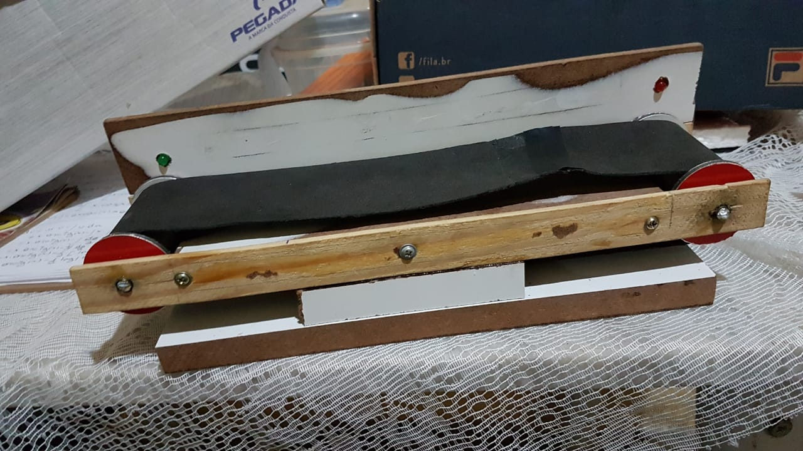
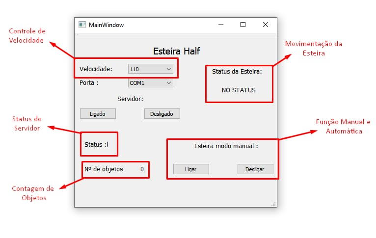

# Esteira Half
--------------------------
Esteira indústria automática e manual
Resumo: A Esteira Half é um projeto criado voltado a imagem de uma esteira Industrial presente em grandes fábricas, utilizadas para agilizar processos de locomoção de objetos em uma série de montagem ou até determinado local. 

# 1.Manual do usuário
--------------------------
Como funciona a Esteira Half?
A esteira tem o intuito de ser simples e direta: fazer a contagem do número de objetos acrescentados nela, e transitar entre suas funções manuais e automáticas, na sua função manual apenas trabalha com a opção de ligar e desliga-la ou seja o usuário determina se a esteira vai estar em movimento ou não, tendo em vista a utilização de esteiras em setores de montagem.
A função automática da esteira trabalha a partir do sensor, através de um calculo pré-determinado a média de tempo até o fim da esteira a esteira continua em movimento até não detectar outro objeto

# 2.Interface QT
--------------------------
A interface no Qt é onde acontece as principais funções do programa. Primeiramente é preciso ligar o servidor em seguida o todas as portas seriais disponiveis 

Após a conexão da porta o usuário deve selecionar a velocidade e decidir se vai querer a esteira em seu modo manual ou automatico   

# 3.Servidor Web
--------------------------

Dentro do site temos a contagem de número de objetos, e o controle do estado da esteira com os botões e o status em que a esteira se encontra, se esta em movimento ou repouso.
